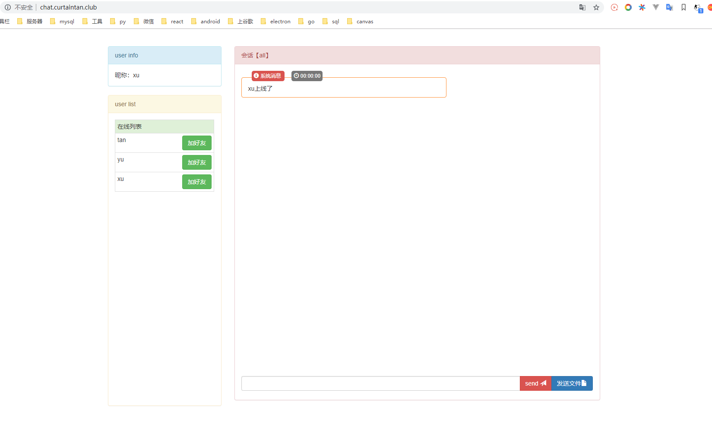
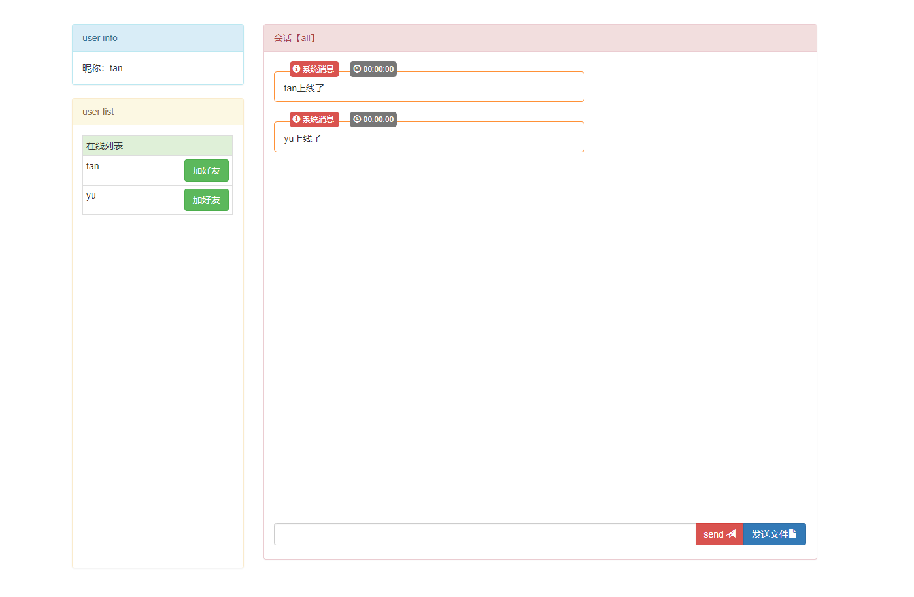
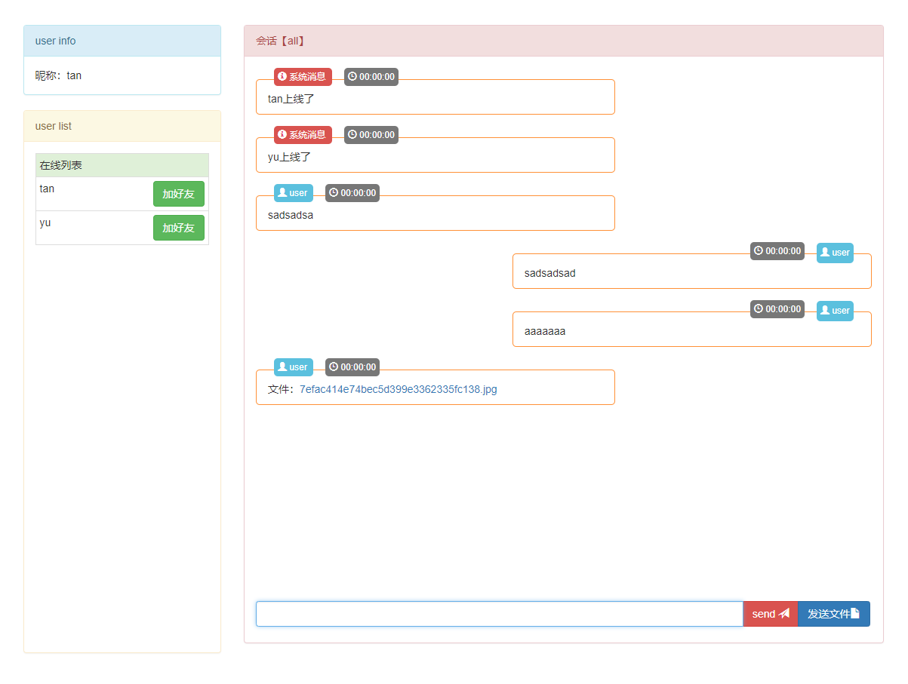

## 在线聊天demo

### 项目说明：
    使用websocket.io + express + bootstrap 搭建而成

#### 实现功能：
- 在线聊天
- 上下线通知
- 添加好友
- 发送文件
- 发送图片
- 好友单聊：发送单聊格式：好友昵称 + # + 聊天内容

### 线上地址：
[直达](http://chat.curtaintan.club/)

### 项目截图：

